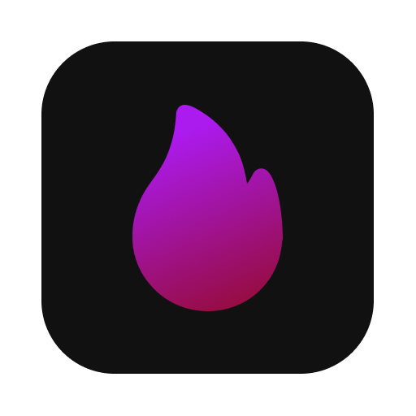

# Stream Bloat

Read Twitch Chat while playing Minecraft or whatever games you play.

I started this project because I didn't want to keep looking on my phone while streaming, and I don't have 2 monitors or a phone stand. So, yeah.

## Installation

See the [Release Page](https://github.com/nicksname1/stream-bloat/releases), and the download the right package for your system.

Available for **linux**. **Windows** and **Mac** was not tested.

### Usage

The window must be pinned as **"Always on Top"**.

- **Linux:**   This can be done by opening the window menu (<kbd>alt</kdb> + <kdb>space</kdb>).
- **Windows:**   There is a guide here: [How To Geek](https://www.howtogeek.com/196958/ways-to-make-a-window-always-on-top-on-windows/)

### Future Plans

- Support for YouTube stream chat
- Better documentation

### Contributing

Report bugs, make suggestions, or write some code. All contributions are welcome.
